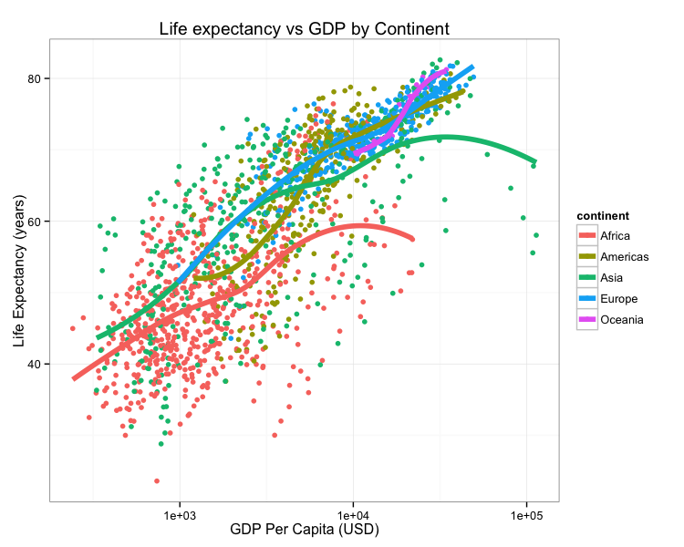
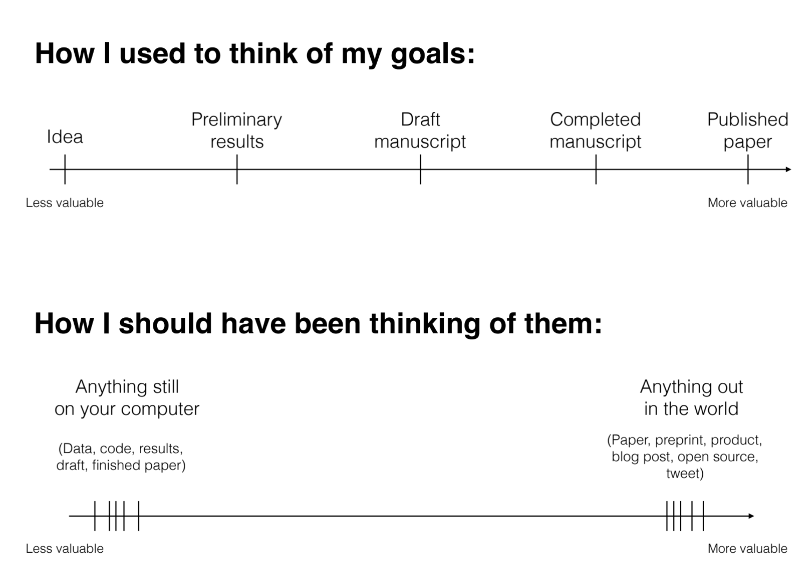
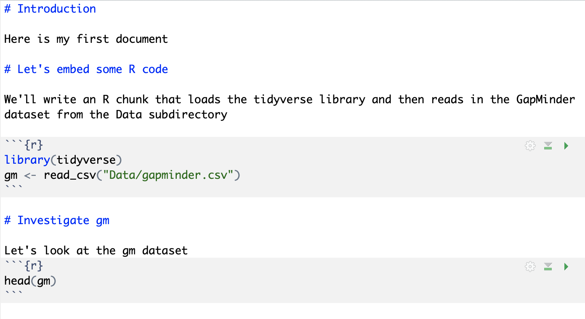
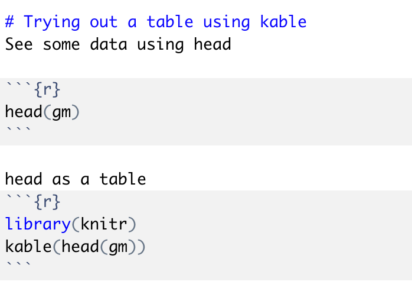

Contemporary life science is plagued by reproducibility issues. This workshop covers some of the barriers to reproducible research and how to start to address some of those problems during the data management and analysis phases of the research life cycle. In this workshop we will cover dynamic document generation with RMarkdown and RStudio to weave together reporting text with executable R code to automatically generate reports in the form of PDF, Word, or HTML documents. We will then investigate the RStudio interface to GitHub so that we can share our reports with the world. Using RMarkdown and GitHub is also the first step towards creating a website or blog to share your data analyses, or even write a book. We will show examples of what is possible throughout the workshop.

## Why care about reproducible research?

- Scientists in the United States spend [$28 billion](http://journals.plos.org/plosbiology/article?id=10.1371/journal.pbio.1002165) each year on basic biomedical research that cannot be repeated successfully.
- A reproducibility study estimated that [75 to 90% of preclinical study results cannot be reproduced](https://www.ncbi.nlm.nih.gov/pubmed/25552691)
- The Journal _Nature_ on the [issue of reproducibility](http://www.nature.com/news/reproducibility-1.17552):
    - "_Nature_ and the Nature research journals will introduce editorial measures to address the problem by improving the consistency and quality of reporting in life-sciences articles... **we will give more space to methods sections. We will examine statistics more closely and encourage authors to be transparent, for example by including their raw data.**"  
    - _Nature_ also released [code and software checklist](https://www.nature.com/documents/nr-software-policy.pdf), **strongly** recommending use of GitHub for code sharing


Consider this figure:



How do we reproduce it? What do we need?

- The data.
    - Data points themselves.
    - Other metadata.
- The code.
    - Should be readable.
    - Comments in the code / well-documented so a regular person can figure out how it runs.
    - How were the trend lines drawn?
    - What version of software / packages were used?
    
This kind of information is rarely available in scientific publications, but it's now extraordinarly easy to put this kind of information on the web.

Could I replicate Figure 1 from your last publication? If not, what would you need to provide or do so I could replicate your results?

**As scientists we should aim for _robust_ and _reproducible_ research**

- "**Robust research** is about doing small things that stack the deck in your favor to prevent mistakes."  
  _---Vince Buffalo, author of Bioinformatics Data Skills (2015)_.
- **Reproducible research** can be repeated by other researchers with the same results. 

### Reproducibility is hard!

1. Biological data can be large and high dimensional making it hard to easily inspect or visualize. Workflows involve multiple steps and it's hard to inspect every step.
1. Unlike in the wet lab, we don't always know what to expect of our genomics data analysis.
1. It can be hard to distinguish *good* from *bad* results.
1. Code is usually only run once to generate results for a publication, and is more likely to contain silent bugs. (code that may produces unknowingly incorrect output rather than stopping with an error message).

### What's in it for _you?_  

Yeah, it takes some effort to be robust and reproducible. However, it will:

1. make your life (and science) easier, and
2. incresase the reach of your work

Most likely, you will have to re-run your analysis more than once. In the future, you or a collaborator may have to re-visit part of the project. Your most likely collaborator is your future self, and your past self doesn't answer emails. You can make modularized parts of the project into re-useable tools for the future. Reproducibility makes you easier to work and collaborate with.  

David Robinson, data scientist with DataCamp has said that the value of your work is dependent on sharing it. If you're interested, you can view his whole [rstudio::conf 2019 talk](https://resources.rstudio.com/rstudio-conf-2019/the-unreasonable-effectiveness-of-public-work)




### Some recommendations for reproducible research

1. **Write code for humans, write data for computers.** 
    - Code should be broken down into small chunks that may be re-used.  
    - Make names/variables consistent, distinctive and meaningful.  
    - Adopt a [style](http://adv-r.had.co.nz/Style.html) and be consistent.
    - Write clear, concise comments. 
1. **Make incremental changes.** Work in small steps with frequent feedback. Use version control.
1. **Make assertions and be loud, in code and in your methods.** Add tests in your code to make sure it's doing what you expect. See <http://software-carpentry.org/v4/test/> for resources on testing code.
1. **Use existing libraries (packages) whenever possible.** Don't reinvent the wheel. Use functions that have already been developed and tested by others.
1. **Prevent catastrophe and help reproducibility by making your data _read-only_.** Rather than modifying your original data directly, always use a workflow that reads in data, processes/modifies, then writes out intermediate and final files as necessary.
1. **Encapsulate the full project into one directory that is supported with version control.** See: Noble, William Stafford. "A quick guide to organizing computational biology projects." [_PLoS Comput Biol_ 5.7 (2009): e1000424](http://journals.plos.org/ploscompbiol/article?id=10.1371/journal.pcbi.1000424).
1. **Release your code and data.** Simple. Without your code and data, your research is not reproducible.
    - GitHub (<https://github.com/>) is a great place for storing, distributing, collaborating, and version-controlling code.
    - RPubs (<http://rpubs.com/>) allows you to share dynamic documents you write in RStudio online.
    - Figshare (<http://figshare.com/>) and Zenodo (<https://zenodo.org/>) allow you to upload any kind of research output, publishable or not, free and unlimited. Instantly get permanently available, citable DOI for your research output.
    - _"Data/code is available upon request"_ or _"Data/code is available at the lab's website"_ are becoming unacceptable.
1. **Write code that uses relative paths.**
    - Don't use hard-coded absolute paths (i.e. `/Users/marieke/Data/seq-data.csv` or `C:\Marieke\Documents\Data\Project1\data.txt`). 
    - Put the data in the project directory and reference it _relative_ to where the code is, e.g., `data/gapminder.csv`, etc.  
1. **Always set your seed.** If you're doing anything that involves random/monte-carlo approaches, always use `set.seed()`.
1. **Document everything and use code as documentation.**
    - Document why you do something, not mechanics. 
    - Document your methods and workflows.
    - Document the origin of all data in your project directory.
    - Document **when** and **how** you downloaded the data.
    - Record **data** version info.
    - Record **software** version info with `session_info()`.
    - Use dynamic documentation to make your life easier.

## RMarkdown

RMarkdown is a variant of Markdown that lets you embed R code chunks that execute when you compile the document. What, what? Markdown? Compile? What's all this about?

### Markdown

Ever heard of HTML? It's what drives the internet. HTML is a _markup language_ - that's what the _ML_ stands for. The terminology evolved from "marking up" paper manuscripts by editors, where the editor would instruct an author or typesetter how to render the resulting text. Markup languages let you annotate **text** that you want to display with instructions about how to display it. 

I emphasize **text** because this is fundamentally different than word processing. When you use MS Word, for example, you're creating a special proprietary binary file (the .docx) file that shows you how a document looks. By contrast, writing in a markup language like HTML or Markdown, you're writing plain old text, using a text editor. The toolchain used to render the markup text into what you see on a display or in a PDF has always been and will always bee free and open. 

### RMarkdown workflow

RMarkdown is an enhanced version of Markdown that lets you embed R code into the document. When the document is compiled/rendered, the R code is executed by R, the output is then automatically rendered as Markdown with the rest of the document. The Markdown is then further processed to final output formats like HTML, PDF, DOCX, etc.


## Authoring RMarkdown documents

> **_Note_**: Before going any further, open up the options (Tools, Global Options), click the RMarkdown section, and **uncheck** the box, _"Show output inline for all R Markdown documents."_

### From scratch

First, open RStudio. Create a new project. Quit RStudio, then launch RStudio using the project file (.Rproj) you just created.

Next, download the gapminder data from the [HSL website](https://guides.hsl.virginia.edu/data/workshops#s-lg-box-19899864). Put this file in your R project directory. Maybe put it in a subdirectory called "data." Importantly, now your code and data will live in the same place.

Let's create a bare-bones RMarkdown document that compiles to HTML. In RStudio, select **File**, **New File**, **R Markdown...**. Don't worry about the title and author fields. When the new document launches, select everything then delete it. Let's author an RMarkdown file from scratch. Save it as `fromscratch.Rmd`. 



Hit the **Knit HTML** button in the editor window. You should see the rendered document pop up.

So let's break that down to see exactly what happened there. Recall the *RMarkdown Workflow* shown above. You start with an RMarkdown document (Rmd). When you hit the Knit HTML button, The **knitr** R package parses through your source document and executes all the R code chunks defined by the "```{r}" chunk blocks. The source code itself and the results are then turned back into regular markdown, inserted into an intermediate markdown file (.md), and finally rendered into HTML by [Pandoc](http://pandoc.org/).

Try this. Instead of using the Knit button, load the knitr package and just knit the document to markdown format. Run this in the console.


```r
library(knitr)
knit("FromScratch.Rmd")
```

Now, open up that regular markdown file and take a look.

### From a template with YAML metadata

Go ahead and start a new R Markdown document. Fill in some title and author information.

This is going to put a YAML header in the file that looks something like this:

```
---
title: "Gapminder Analysis"
author: "Marieke Jones"
date: "March 11, 2019"
output: html_document
---
```

The stuff between the three `---`s is metadata. You can read more about what kind of metadata can be included in the [RMarkdown documentation](https://bookdown.org/yihui/rmarkdown/). Try clicking the little gear icon and setting some options, like including a table of contents and figure captions. Notice how the metadata front matter changes.

```
---
title: "Gapminder analysis"
author: "Marieke Jones"
date: "March 11, 2019"
output: 
  html_document: 
    fig_caption: yes
    toc: yes
---
```

Now, delete everything in that document below the metadata header and paste in what we had written before (above). Save this document under a different name (`rmdwmeta.Rmd` for example). You'll now see that your HTML document takes the metadata and makes a nicely formatted title.

Let's add a plot in there. Write a section heading *Our first plot* and then open up a new R chunk like this:


Using RStudio you can fiddle around with different ways to make the graphic and keep the one you want. Maybe it looks like this:


### Chunk options

You can modify the behavior of an R chunk with [options](http://yihui.name/knitr/options/). Options are passed in after a comma in the "```{r}" chunk heading. 

Some commonly used options include:

- `echo`: (`TRUE` by default) whether to include R source code in the output file.
- `results` takes several possible values:
    - `markup` (the default) takes the result of the R evaluation and turns it into markdown that is rendered as usual.
    - `hide` will hide results.
    - `hold` will hold all the output pieces and push them to the end of a chunk. Useful if you're running commands that result in lots of little pieces of output in the same chunk.
    - `asis` writes the raw results from R directly into the document. Only really useful for tables.
- `include`: (`TRUE` by default) if this is set to `FALSE` the R code is still evaluated, but neither the code nor the results are returned in the output document. 
- `fig.width`, `fig.height`: used to control the size of graphics in the output.

Let's copy our better plot r chunk and then try modifying the chunk options to use different values for `echo`, `fig.show`, and `include`.
- `echo = FALSE` will hide the code but show the plot
- `fig.show = "hide"` will show the code but hide the plot
- `include = FALSE` will hide both the code and the plot

See the full list of options here: <http://yihui.name/knitr/options/>. There are lots!

A special note about **caching**: The `cache=` option is automatically set to `FALSE`. That is, every time you render the Rmd, all the R code is run again from scratch. If you use `cache=TRUE`, for this chunk, knitr will save the results of the evaluation into a directory that you specify. When you re-render the document, knitr will first check if there are previously cached results under the cache directory before really evaluating the chunk; if cached results exist and this code chunk has not been changed since last run (use MD5 sum to verify), the cached results will be (lazy-) loaded, otherwise new cache will be built; if a cached chunk depends on other chunks (see the `dependson` option) and any one of these chunks has changed, this chunk must be forcibly updated (old cache will be purged). **See [the documentation for caching](http://yihui.name/knitr/demo/cache/).**

### Tables with kable

The [knitr](http://yihui.name/knitr/) package that runs the RMarkdown document in the background also has a function called `kable` that helps with printing tables nicely. It's only useful when you set `echo=FALSE` and `results='asis'`. Try this.



## Tables using gt

The `kable` function will work to make very simple tables. If you are interested in creating beautiful, publication-ready tables, you might consider looking into the `gt` package. It is not available from the Comprehensive R Archive Network (CRAN) yet, so we will not demo it today, but it is the new, state-of-the-art package for creating display tables. Please check out the [gt package documentation](https://gt.rstudio.com/)

### Changing output formats

Now try this. If you were successfully able to get a LaTeX distribution installed, you can render this document as a PDF instead of HTML. Try changing the line in the metadata from `html_document` to `pdf_document`. Notice how the _Knit HTML_ button in RStudio now changes to _Knit PDF_. Try it. If you didn't get a LaTeX engine installed this won't work. Go back to the setup instructions after class to give this a try.

## Distributing Analyses

Now that you know how to make documents with RMarkdown, we should talk about sharing them. You can host your analyses on a public GitHub repo, create a website or blog to showcase your analyses, or publish using RPubs.

[RPubs.com](http://rpubs.com/) is a free service from RStudio that allows you to seamlessly publish the results of your R analyses online. Sign up for an account at [RPubs.com](http://rpubs.com/), then sign in on your browser.


## GitHub


## Resources for RMarkdown

- [RMarkdown, The Definitive Guide](https://bookdown.org/yihui/rmarkdown/) Excellent, thorough guide to all things RMarkdown
- [In-browser markdown editor](http://stackedit.io)
- [A good markdown reference](http://commonmark.org/help/)
- [A good 10-minute markdown tutorial](http://commonmark.org/help/tutorial/)
- [RStudio's RMarkdown Cheat Sheet](https://github.com/rstudio/cheatsheets/raw/master/rmarkdown-2.0.pdf) and [RMarkdown Reference Sheet](https://www.rstudio.com/wp-content/uploads/2015/03/rmarkdown-reference.pdf)
- [The RMarkdown documentation](http://rmarkdown.rstudio.com/) has an excellent [getting started guide](http://rmarkdown.rstudio.com/lesson-1.html), a [gallery of demos](http://rmarkdown.rstudio.com/gallery.html), and several [articles](http://rmarkdown.rstudio.com/articles.html) illustrating advanced usage.
- [The knitr website](<http://yihui.name/knitr/>) has lots of useful reference material about how knitr works, [options](http://yihui.name/knitr/options/), and more.
- [rticles package](https://github.com/rstudio/rticles) provides RMarkdown templates for several scientific journals
- [gt package](https://gt.rstudio.com/) allows you to create beautiful tables for RMarkdown publications

## Resources for GitHub
- [Jenny Bryan's Happy Git with R website](https://happygitwithr.com/) is an excellent guide for dealing with GitHub from RStudio
- [Software Carpentry's lesson on GitHub](http://swcarpentry.github.io/git-novice/)
- [Git in Practice book](https://www.manning.com/books/git-in-practice) is approachable for novices
- [GitHub training materials](https://help.github.com/articles/git-and-github-learning-resources/)
